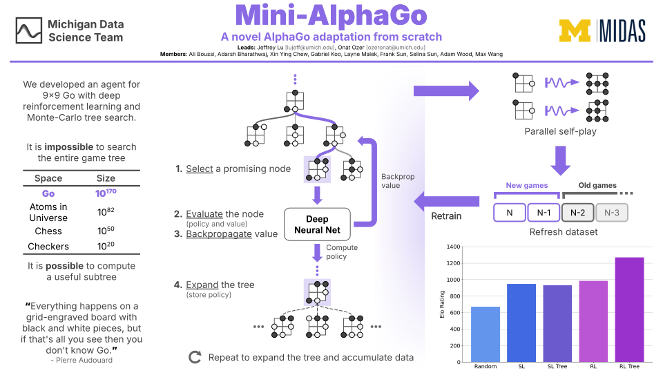

# Mini-AlphaGo, Winter 2025

We built a modified hybrid of [AlphaGo](https://www.nature.com/articles/nature16961) and [AlphaGo Zero](https://www.nature.com/articles/nature24270) for 9x9 Go using only computational libraries

## Structure

Below is a high-level overview of the main components of this project and the relevant files.

*Note:* Most code files provide example usage and all code files are well-documented, so implementation details will not be re-explained in this README.

<ins>**Core Go Library**</ins> {<small>`board.py`, `group.py`, `game_node.py`</small>}
 
This contains all the logic for the game of Go following the [Tromp-Taylor rules](https://tromp.github.io/go.html) for computer Go. The implementation relies heavily on NumPy to store and process board states and its derivative objects efficiently.

<ins>**Data Processing & Compilation**</ins> {<small>`data_preprocess.py`, `dataset.py`, `imported_game.py`</small>}
 
The preprocessing component converts game states into PyTorch Tensors with a more meaningful structure extremely similar to that used in AlphaGo Zero. The dataset (compilation) component collects data from self-play games and from online games in [SGF format](https://en.wikipedia.org/wiki/Smart_Game_Format). These datasets are also easily converted to PyTorch DataLoaders.

<ins>**Neural Network**</ins> {<small>`network.py`</small>}
 
This contains the Neural Net's structure, which is extremely similar to that used in AlphaGo Zero. This also contains useful utilities like loading, saving, and loss.

<ins>**Tree**</ins> {<small>`game_node.py`, `tree_node.py`, `monte_carlo.py`</small>}
 
This contains the tree structure between nodes and key [Monte-Carlo Tree Search](https://en.wikipedia.org/wiki/Monte_Carlo_tree_search) (MCTS) operations (select, expand, evaluate, backpropagate). Note that for this project, the practice of using rollouts to estimate the value at a state is replaced by the neural network's value estimate. Given a large number of searches, the tree naturally builds progressively longer rollouts regardless.

<ins>**Pre-training**</ins> {<small>`bot.py`</small>}
 
This provides a unified interface for interacting with different types of bots (random, neural network only, neural network + tree)

<ins>**Training**</ins> {<small>`supervised_learning.py`, `reinforcement_learning.py`, `train_alphago.py`, `mp_self_play.py`, `mp_train_alphago.py`</small>}
 
This contains the training scripts for supervised and reinforcement learning. Files with the `mp` prefix use multiprocessing for self-play to improve performance during the dataset (re)-generation component of reinforcement learning.

<ins>**Evaluation**</ins> {<small>`elo_calculator.py`, `elo_graph.py`</small>}
 
This generates and visualizes performance data for different configurations of bots.

<ins>**Visualization**</ins> {<small>`web_vis.py`</small>}
 
This visualizes the policy, value, and tree states in an interactive web interface.

## Schedule

| **Week** | **Links** |
| --- | --- |
| 1 | [Slides](https://docs.google.com/presentation/d/1-xUB_iLC-hbhHI7JJtxdNb0yJfJjoJYizdwDDreBi8k/edit?usp=sharing), [Play Online Go](https://online-go.com/), [Computer Go Rules](https://tromp.github.io/go.html)
| 2 | [Slides](https://docs.google.com/presentation/d/1Tl5gFVL9Pp-qJr6oYB78062bHCQMhRM6sasR86lCWHc/edit?usp=sharing), [NN Arch](https://discovery.ucl.ac.uk/id/eprint/10045895/1/agz_unformatted_nature.pdf#page=27), [PyTorch CNN example](https://pytorch.org/tutorials/beginner/blitz/cifar10_tutorial.html) |
| 3 | [Slides](https://docs.google.com/presentation/d/1yF0llAtNVfPCPmMXlIslRqWAPUI-A_-ez7vHlBAoXFc/edit?usp=sharing), [PyTorch Modules](https://pytorch.org/docs/stable/notes/modules.html#modules-as-building-blocks) |
| 4 | [Slides](https://docs.google.com/presentation/d/1kch18ub-a1Mqck-qaXYb6X_Oq3d1L4-R20YT2aCWkdE/edit?usp=sharing), [SL Description](https://discovery.ucl.ac.uk/id/eprint/10045895/1/agz_unformatted_nature.pdf#page=25) |
| - | Spring Break |
| 5 | [Slides](https://docs.google.com/presentation/d/1LEbv5XmeUX-hytKAuPFUy0yyKeiUiF1bOkyMBQJuSTI/edit?usp=sharing) |
| 6 | [Slides](https://docs.google.com/presentation/d/1TNW__iBweAtqnh088tEdCIuehKC8lB6dVtbhaNIpi_8/edit?usp=sharing), [AGZ MCTS Algorithm](https://discovery.ucl.ac.uk/id/eprint/10045895/1/agz_unformatted_nature.pdf#page=25) |
| 7 | [Slides](https://docs.google.com/presentation/d/1wIUXCe9MaicW_u0sWpuu7ez-zFpV4AijGfOX_aeQJbA/edit?usp=sharing), [AGZ MCTS Algorithm](https://discovery.ucl.ac.uk/id/eprint/10045895/1/agz_unformatted_nature.pdf#page=25) |
| 8 | [Slides](https://docs.google.com/presentation/d/1BjuzCKrI5Vfv_F5P5DK3Sx71WJa6JHJf2YE8hAVNCw0/edit?usp=sharing) |
| 9 | [Slides](https://docs.google.com/presentation/d/1G-nk0L82hz_oKPSu5gVLuP0IPvvzAgibMXir0PsA7E0/edit?usp=sharing), [AGZ Self-Play](https://discovery.ucl.ac.uk/id/eprint/10045895/1/agz_unformatted_nature.pdf#page=24) |
| 10 | [Slides](https://docs.google.com/presentation/d/1xUUn0M5ybaiBdqf3to-zYb7lVD8xvjtTtmi1IMmWr9c/edit?usp=sharing), [AGZ Self-Play](https://discovery.ucl.ac.uk/id/eprint/10045895/1/agz_unformatted_nature.pdf#page=24) |

For a more detailed list of topics and resources, check the most recent "This Week in Mini-AlphaGo" email (released every Wednesday afternoon).

## Acknowledgements

<big>**Leads**</big>
 
Jeffrey Lu - <small><tt>lujeff&nbsp;[at]&nbsp;umich&nbsp;[dot]&nbsp;edu</tt></small>
 
Onat Ozer - <small><tt>ozeronat&nbsp;[at]&nbsp;umich&nbsp;[dot]&nbsp;edu</tt></small>

<big>**Members**</big>
 
Ali Boussi, Adarsh Bharathwaj, Xin Ying Chew, Gabriel Koo, Layne Malek, Frank Sun, Selina Sun, Adam Wood, Max Wang

<big>**Code Contributions**</big>
 
Jeffrey wrote the core Go library, parallelized training scripts, web visualizer, and SGF parser.

Onat wrote the Elo rating evaluation system and standard training script.

All remaining components (preprocessing, MCTS, training pipelines, etc.) were written by members.

<big>**Content Contributions**</big>
 
A large majority of technical visuals in slides were designed from scratch by the leads.

<big>**Compute**</big>
 
This project would not have been possible without the compute resources provided [MIDAS](https://midas.umich.edu/), [U-M ARC High Performance Computing](https://its.umich.edu/advanced-research-computing), and Google Cloud
